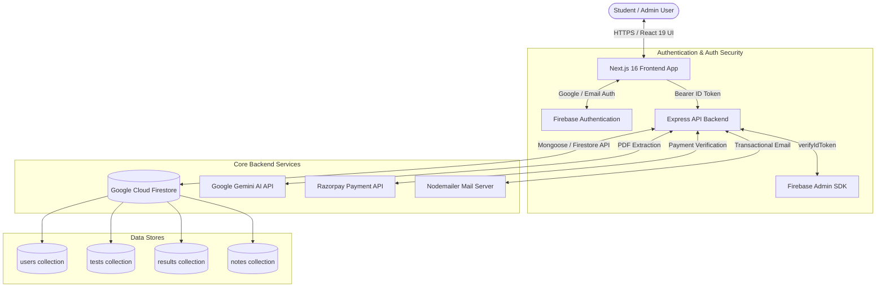

# Walkthrough 1: System Architecture, Workflow, Security & Infrastructure Guide

This document provides a comprehensive overview of the technical architecture, data flow, security model, and infrastructure of the **Mock Test Platform**.

---

## 1. System Technology Stack

The platform is engineered as a decoupled, multi-tier cloud web application with high performance, auto-scaling, and modern rendering engines.

| Layer | Technologies Used | Key Features |
| :--- | :--- | :--- |
| **Frontend UI** | Next.js 16 (React 19, TypeScript/JS), Tailwind CSS | App Router, Server/Client components, Responsive layout, Glassmorphism design |
| **Math & Rich Rendering** | KaTeX, MathLive, html2canvas, jsPDF, @react-pdf/renderer | Visual Math formula creation, LaTeX rendering, Client-side PDF Scorecard export |
| **Data Visualization & Animations** | Recharts, Framer Motion, Lottie, Three.js / Vanta | Live percentile graphs, score distribution charts, interactive mascots |
| **Backend API** | Node.js, Express.js 5, Cluster module | Serverless on Vercel or Multi-core worker cluster locally, NodeCache |
| **Database & Storage** | Google Cloud Firestore (Firebase Admin & Client SDK) | Real-time database, collection indexing, user progress storage |
| **Authentication & RBAC** | Firebase Authentication | Email/Password, Google OAuth, Firebase Admin ID Token Verification |
| **AI Integration** | Google Generative AI (`@google/generative-ai` - Gemini) | Automated PDF Question Bank parsing, solution extraction, options structuring |
| **Payment Gateway** | Razorpay Node.js SDK | Order creation, signature verification, webhooks for test series & notes unlocking |
| **Mail Services** | Nodemailer | Transactional transactional notifications, submission receipts |

---

## 2. Architecture & Data Flow Diagram



---

## 3. Core Request & Feature Workflows

### A. Authentication & Role-Based Authorization Workflow
1. User logs in on Frontend via Firebase Client SDK (Email/Password or Google OAuth).
2. Firebase issues a JWT ID Token to the client.
3. Every API call to backend attaches headers: `Authorization: Bearer <ID_TOKEN>`.
4. Backend `authMiddleware.protect` extracts token, verifies signature using `admin.auth().verifyIdToken()`.
5. Backend fetches user profile from Firestore `users` collection to check role (`role: 'admin'` vs `role: 'student'`).
6. If role authorization (`authorize('admin')`) fails, API returns `403 Forbidden`.

### B. AI-Powered Question Bank Upload Workflow (Gemini AI)
1. Admin uploads a question paper PDF via Admin Dashboard.
2. Express route receives PDF buffer via `multer`.
3. PDF content is sent to **Google Gemini AI API** (`@google/generative-ai`).
4. Gemini parses text and raw mathematical expressions, formatting questions into a structured JSON array containing:
   - Question text & LaTeX equations
   - MCQ Options (A, B, C, D)
   - Correct Option Index
   - Step-by-step solution / explanation
5. Result is cached in NodeCache and rendered in Admin UI for instant review & edit before saving to Firestore.

### C. Test Attempt & Automated Evaluation Workflow
1. Student enters Exam Gateway (`/exam/[id]`), fetches test metadata.
2. Exam Interface initializes timer and question palette.
3. Student submits test or timer hits 0:
   - Answers payload sent to `POST /api/results/submit`.
   - Backend evaluates correct (+4), negative marking (-1), or unattempted (0) scores.
   - Computes total marks, percentage, topic-wise accuracy.
   - Saves record to `results` collection in Firestore.
4. Client receives instant analytical breakdown with percentile & rank estimation.

### D. Payment & Content Unlocking Workflow
1. User clicks **Buy Series** or **Unlock Notes**.
2. Frontend requests `POST /api/payments/create-order` with package ID.
3. Express server creates Razorpay Order ID.
4. User completes payment modal on client.
5. Client sends `razorpay_order_id`, `razorpay_payment_id`, and `razorpay_signature` to `/api/payments/verify`.
6. Backend verifies HMAC-SHA256 signature using Razorpay Secret.
7. Upon successful verification, user document in Firestore is updated with unlocked access permissions.

---

## 4. Security & Hardening Implementation

```
┌────────────────────────────────────────────────────────────────────────┐
│                        SECURITY & PROTECTION LAYERS                   │
├────────────────────────────────────────────────────────────────────────┤
│ 1. Firebase Admin Token Verification on all Protected Endpoints        │
│ 2. Role-Based Access Control (RBAC: Admin vs Student)                  │
│ 3. Strict CORS Policy (Whitelist origins + regex Vercel preview URLs)  │
│ 4. Helmet HTTP Header Safeguards (Clickjacking, XSS Protection)        │
│ 5. Environment Secrets Isolation (.env non-committed keys)             │
│ 6. Payload Limits (200MB JSON/URL-Encoded body limits for large PDFs)  │
└────────────────────────────────────────────────────────────────────────┘
```

1. **Token Verification (`backend/middleware/authMiddleware.js`)**:
   - ID Tokens are cryptographically verified using Firebase Admin credentials. Tokens expire automatically, protecting against stolen session state.
2. **CORS Restrictions (`backend/index.js`)**:
   - Allowed origins are explicitly white-listed (`apexmocktest.com`, `localhost`, and specific `FRONTEND_URL`). Vercel deployment origins are checked against secure domain regex pattern (`/\.vercel\.app$/`).
3. **HTTP Header Protection**:
   - Helmet middleware blocks MIME-sniffing, clickjacking, and cross-domain leaks.
4. **Environment Variables Security**:
   - Sensitive keys (`FIREBASE_PRIVATE_KEY`, `MONGODB_URI`, `RAZORPAY_KEY_SECRET`, `GEMINI_API_KEY`) are kept isolated in server `.env` files and never exposed to the public frontend bundle.

---

## 5. Infrastructure & Deployment Overview

- **Deployment Model**: Multi-project hosting on Vercel.
  - **Backend API**: Deployed as Node serverless API (`backend/vercel.json`).
  - **Frontend Client**: Deployed as Next.js 16 SSR/SSG Application.
- **Database**: Cloud Firestore hosted on Google Cloud Platform (GCP) multi-region instance with high availability and automated backup capabilities.
